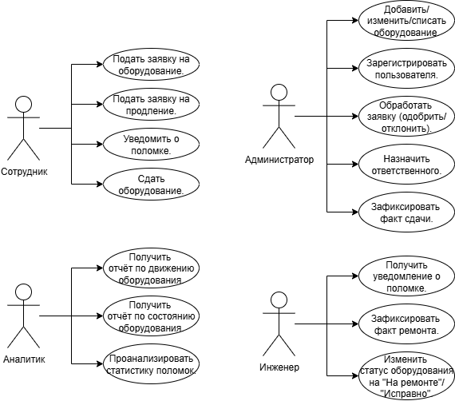
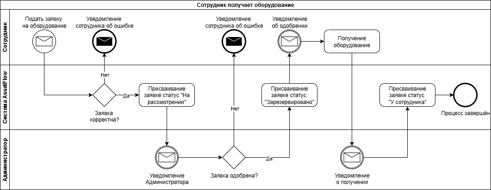
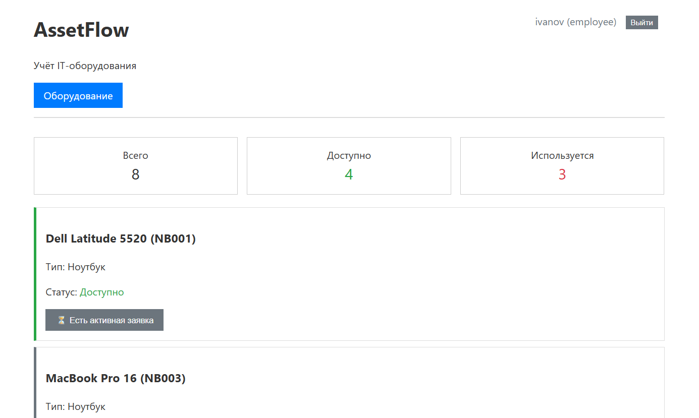
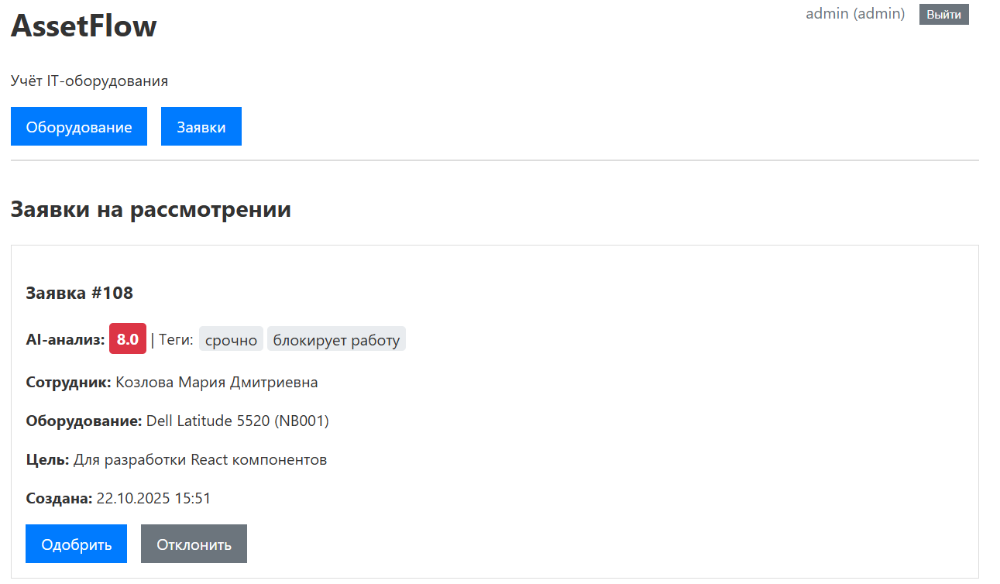
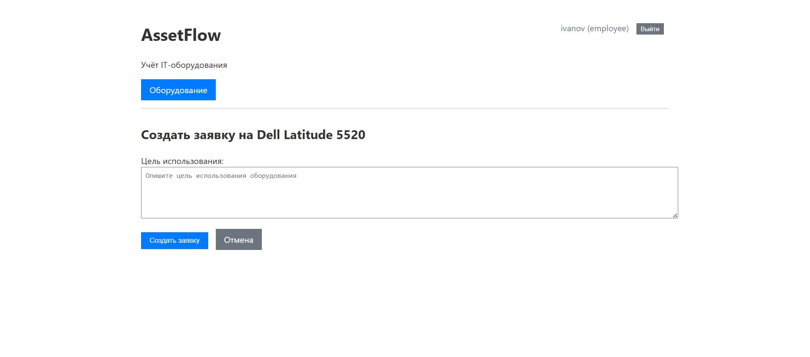

# 🏢 AssetFlow - Система учёта IT-оборудования

**Производственная система управления IT-активами предприятия с полным жизненным циклом оборудования**

[](https://www.python.org/)
[](https://www.djangoproject.com/)
[](https://www.postgresql.org/)

**↓ Готов к стажировке в бэкенд-разработке | Python + Django + PostgreSQL ↓**
---

## 🚀 О проекте

AssetFlow - это комплексное решение для автоматизации учёта IT-оборудования, от выдачи сотрудникам до списания. Система оптимизирует процессы управления техникой и сокращает временные затраты на администрирование.

## 🎯 Проектирование системы

**Архитектурное проектирование** включало разработку:
- **UML Use Case диаграму** - для формализации функциональных требований
- **BPMN-модель** - для визуализации и оптимизации бизнес-процессов
  
| UML Use Case | BPMN-модель |
| :---: | :---: |
|  |  |

## 💻 Технологический стек

- **Backend:** Django 5.0 + Python 3.11+
- **Database:** PostgreSQL
- **Архитектура:** MVC с RESTful API
- **Безопасность:** RBAC, CSRF protection
- **Frontend:** Django Templates, HTML5, CSS3

## 🎯 Ключевые возможности

### 👥 Ролевая модель доступа

| Роль | Функционал |
|------|------------|
| **Сотрудник** | Подача заявок, сообщения о поломках, продление сроков |
| **Администратор** | Управление заявками, приём возвратов, контроль оборудования |
| **Технический специалист** | Ведение ремонтов, обновление статусов |
| **Аналитик** | Отчёты по движениям, статистика поломок |

### 🔄 Бизнес-процессы

- ✅ **Полный цикл оборудования**: выдача → использование → возврат/ремонт
- ✅ **Автоматическое обновление статусов** при операциях
- ✅ **История движений** оборудования
- ✅ **Валидация бизнес-правил** и проверка прав доступа
- ✅ **Умная навигация** с адаптацией под роль пользователя

## 🛠 Быстрый старт

```bash
# Клонирование и установка
git clone https://github.com/Mekito4u/assetflow-inventory.git
cd assetflow-inventory
pip install -r requirements.txt

# Настройка БД и тестовые данные
python manage.py migrate
python manage.py seed_data

# Запуск
python manage.py runserver
```
Доступ: http://localhost:8000

## 📸 Интерфейс системы

| Главная страница | Панель управления | Форма заявки |
| :---: | :---: | :---: |
|  |  |  |

## 📄 Лицензия
*Профессиональное решение для управления IT-инфраструктурой предприятия!*
